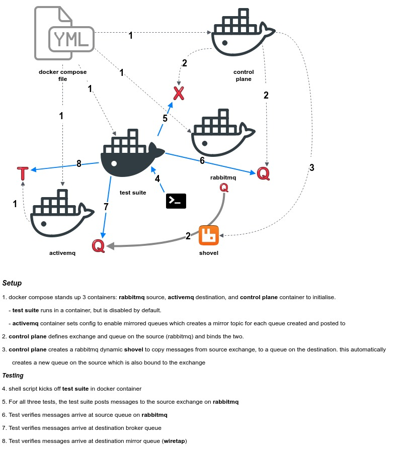

# Broker to Broker forwarding

This is a spike of selective broker to broker forwarding, specifically from RabbitMQ as a source to ActiveMQ as a destination

## Goals

### Transparent forwarding of messages from Rabbitmq exchange to ActiveMQ destination

Rules
- forwarding messages has no impact on existing consumer queues on the source broker
- all messages for selected exchanges are reliably forwarded to the destination broker

### Working example of ActiveMQ Queue Mirroring to facilitate wire tapping

Rules
- Wiretap consumer can subscribe to mirrored queue topic and receive same messages as destination broker queue

## Design

